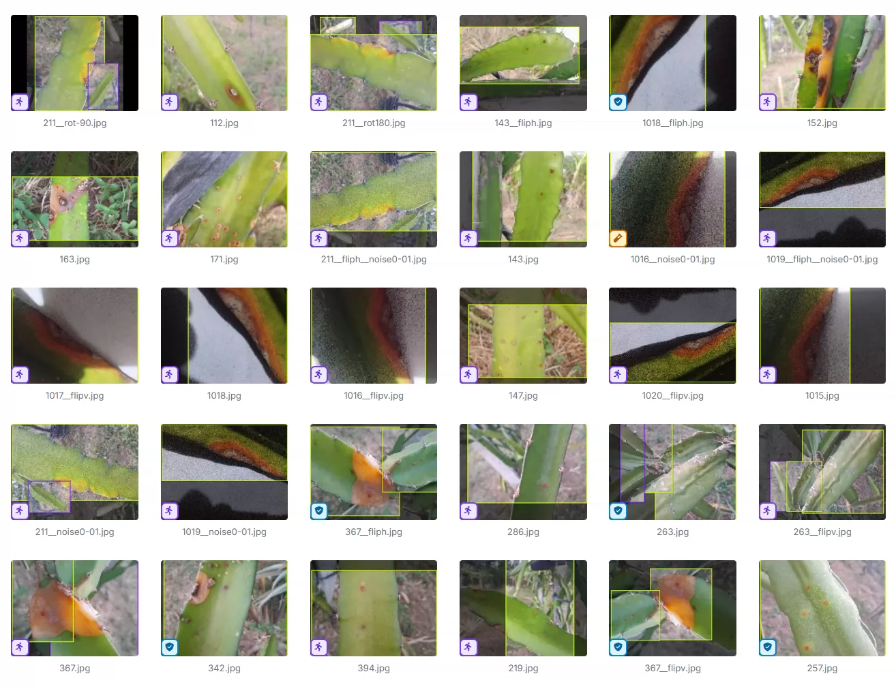
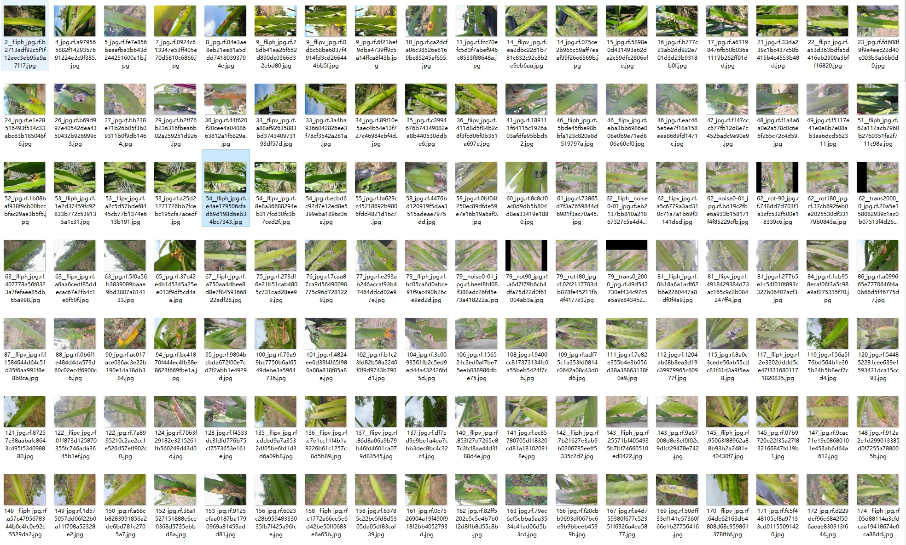
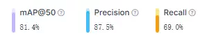
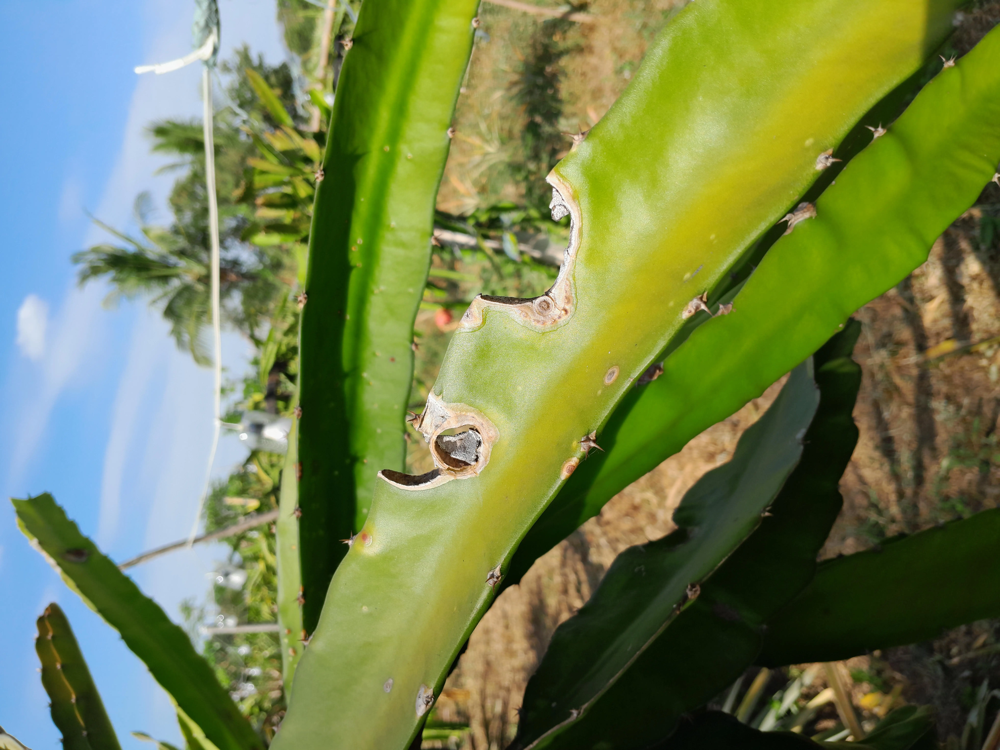
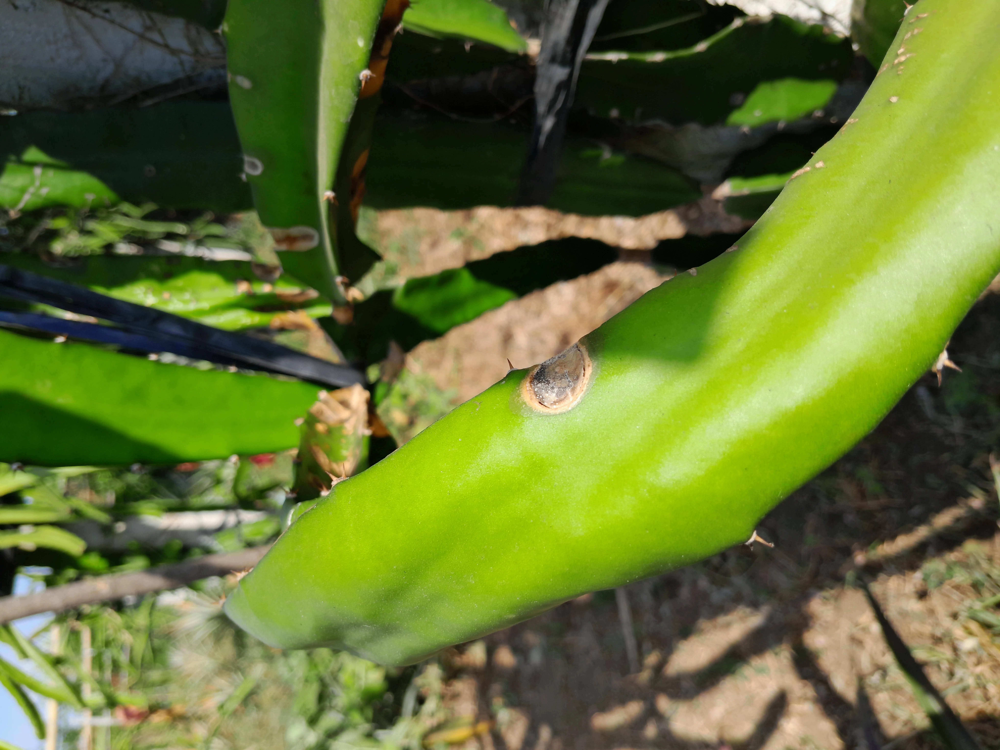
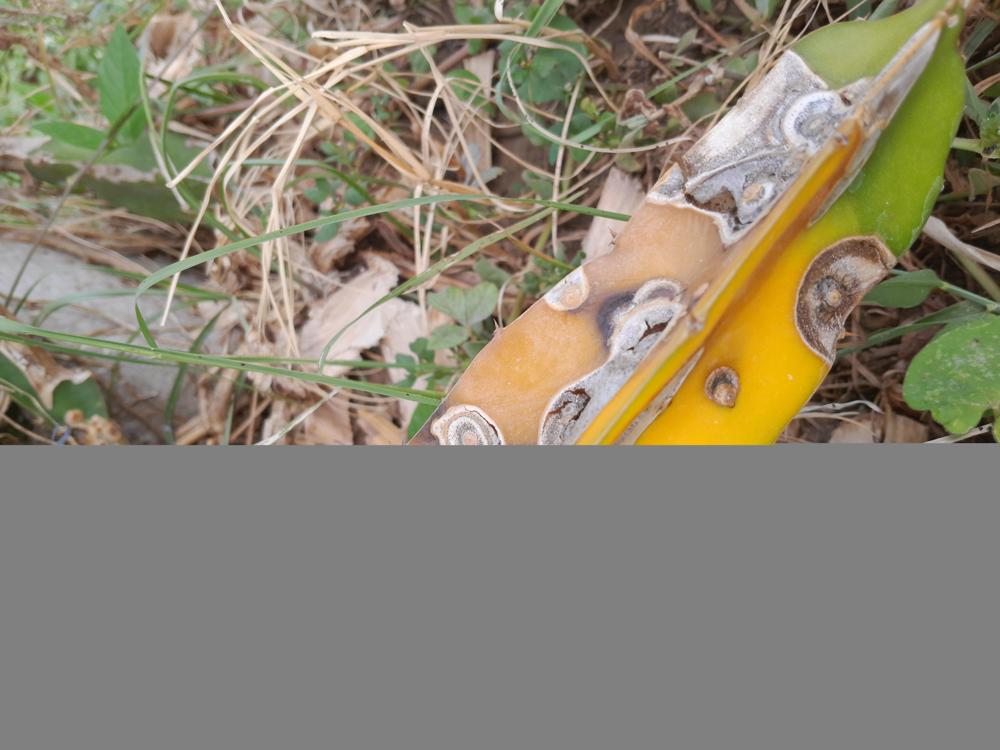
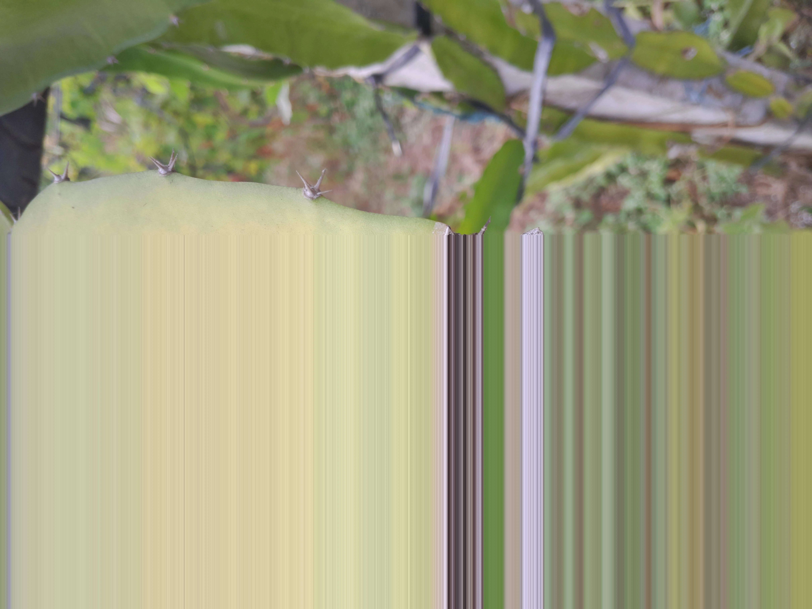

## Body

（Agricultural Product）Cactus Stem Target Detection Dataset

Totally 1329 images, each labeled in YOLO format, divided into training set (936), test set (122), validation set (271)

It is divided into two categories, 'diseased stem' and 'healthy stem'.

All images are high-definition, with a pixel size of approximately 8160 * 6124. The dataset size is about 5G.

Electronic virtual products sold without return or exchange.

## Images

item_1054155617206

Here is a pay link on Stripe ( https://buy.stripe.com/3cs8yP7sY87d0vu9AB ). Please contact me lonlonago@foxmail.com after funding $89, and I will send you a complete data files , thank you!

